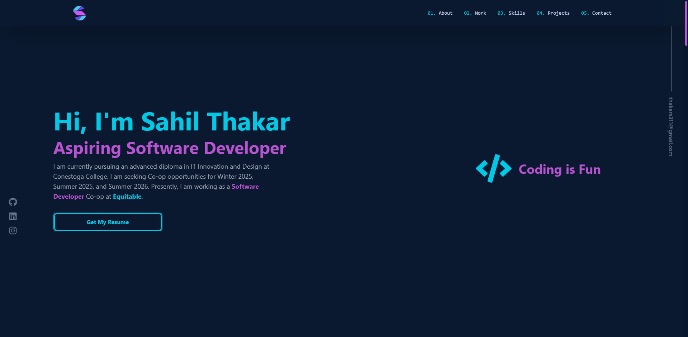

<div align="center">

<h1 align="center" style="font-weight: bold;">Sahil's Portfolio </h1>
</div>

<a href="https://sahilthakar.tech"><h3 align="center">📱 Visit this Project</h3></a>

## 🌐 About This Site

Welcome to Sahil's Portfolio, a showcase of my projects, skills, and professional journey. Built with React, Vite, and TailwindCSS, this site is designed to provide a seamless and engaging user experience. Explore my work, learn more about my background, and feel free to get in touch!

<p align="center">

</p>

## 💻 Technologies

<div align="center" style="margin:10px">
  
  
  
  
  
</div>



## 💡 Getting Started

To get started with the Portfolio project, follow these steps:

1. Clone the repository to your local machine:

   ```sh
   git clone https://github.com/SahilThakar11/Portfolio.git
   ```

2. Navigate to the project directory:

   ```sh
   cd Portfolio
   ```

3. Install the dependencies:

   ```sh
   npm install
   ```

4. Start the development server:

   ```sh
   npm run dev
   ```

5. Open your browser and visit [http://localhost:5173](http://localhost:5173) to see the project in action.

Now you're ready to explore and customize the Portfolio project according to your needs!
